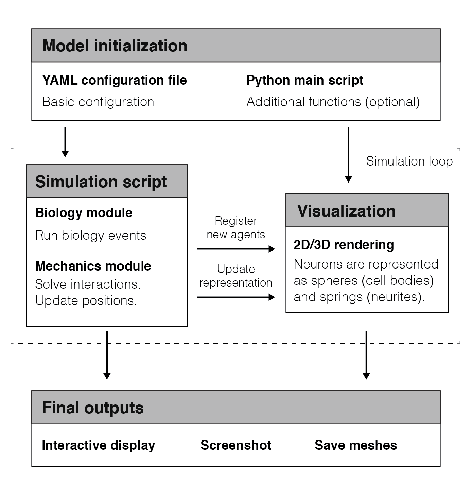
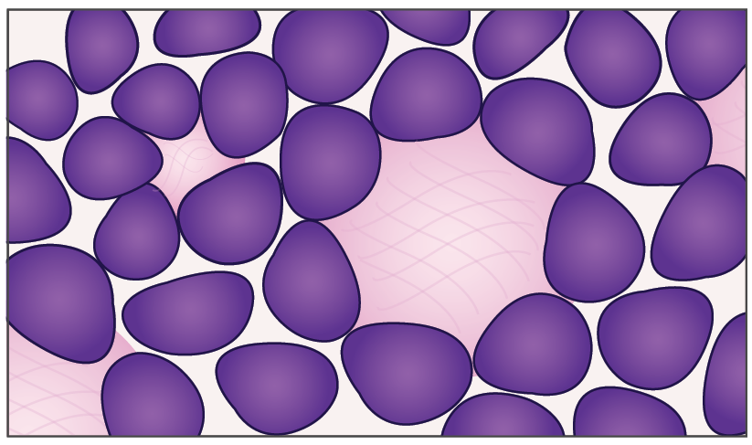
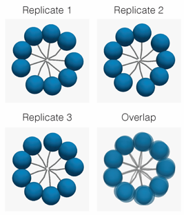

# neurorosettes

 
[](https://neurorosettes.readthedocs.io/en/latest/?badge=latest)
[](https://zenodo.org/badge/latestdoi/569667948)

`neurorosettes` is a Python package that implements agent-based modelling to study the formation of rosette patterns in tissues during neuronal development. It is built on top of the `vedo` package (version 2022.1.0), which provides an interface to plot 3D objects using VTK, to prioritize the visualization of the simulations in real time, without requiring additional processing.

## Installation

The package can be downloaded through pip using `pip install neurorosettes`.

## Usage

`neurorosettes` offers multiple modules to simulate and test new biological hypothesis, such as:
- Cell cycle and death;
- Creation and extension of neuronal processes;
- Physical interactions between cell bodies and neuronal processes;



More information can be found in the [User Guide](user_guide.md).

## Biological basis

Rosettes represent histological patterns that can be identified in various tissues, with particular prominence in the nervous system. One notable subtype, the Homer-Wright (HW) rosette, has been observed in neuroblastoma, a common and lethal extracranial tumor in infants. A circular arrangement of cell bodies (shwon in purple in the figure below) surrounding a common core of fibers (shown in pink) characterizes this pattern. Although previous studies have postulated that HW rosettes originate from poorly differentiated neurons, and result from cell-cell interactions, further validation of these observations has been limited. 



This package aims to provide users with user-friendly tools to simulate this process and it was designed to be easily extensible and replicate different biological scenarios.

## Examples

Users can find three different use cases in the `examples` folder. Firstly, we implemented an idealized scenario in which cells were placed in a radial arrangement and neurite outgrowth was promoted towards their common core. Secondly, we conducted a numerical study based on this idealized case. Finally, we developed a simulation at the tissue level.



The aim of this project is to provide a computational tool that can be used to investigate the formation of rosette structures in tissues, specifically the Homer-Wright rosette subtype found in neuroblastoma. Through this tool, we hope to gain a better understanding of the biological mechanisms underlying rosette formation.

Please note that our study is primarily an introduction to this computational tool and that more complex studies can be conducted using this tool in the future, once experimental data becomes available.

```{toctree}
:maxdepth: 1
:hidden:

user_guide.md
autoapi/index
```