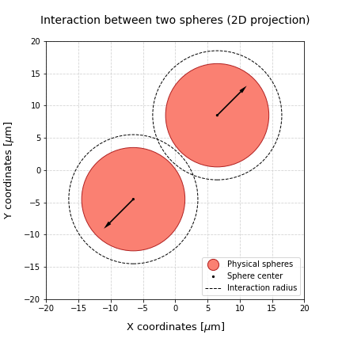
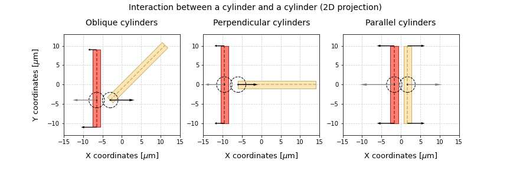

# Physics and interactions

## Object types

We consider two types of physical objects to create biological entities: spheres and cylinders. 
The objects in a simulation  can interact with each other, using sphere-sphere contact functions.

- Cell bodies are defined by spheres (shown in red in the figur below) that have a **center point**,
a **radius** and an **interaction radius**;

- Fibrous materials such as neurites are defined by a cylinder that has two extremity points: the **proximal
point** (closest to the sphere) and the **distal point** (farther from the sphere). Each cylinder is also characterized
by a **radius** and an **interaction radius** (as shown by the distal points represented as blue spheres in
the figure), and a **spring coefficient** and a **default initial length** (represented by the springs
show in the figure.)


## Object interactions

### Sphere-sphere interactions

Sphere objects have a radius of interaction that defines if two objects will interact or not.
If the distance between two objects is smaller than the sum of the interaction radii, then the
objects interact. These interactions are composed by an adhesion component, that pulls the two spheres
together, and a repulsion component, that pushes the spheres away. 

The force that results from the combination of these components is applied to the center of the spheres, 
and will be taken  into account later to compute the position of the sphere in the next time point of the simulation.



### Sphere-cylinder interactions

Sphere-cylinder interactions are computed by identifying the point on the cylinder axis that is closest to the
sphere center, and assuming that the interactions can be represented as sphere-sphere interactions between these
two points. The interaction force that acts on the cylinder is then split between the two cylinder extremities,
according to the distance between the closest point and the extremities. For instance, when the closest point is
placed in the middle of the cylinder axis, the force (represented as a grey arrow) is split evenly between the two 
extremities (as shown by the two black arrows on the cylinder extremity points). However, if the
closest point is one of the extremities, the force will only be applied to that extremity (represented by the single
black arrow on the closest point of the cylinder axis).


### Cylinder-cylinder interactions

Cylinder-cylinder interactions are defined by finding the points that give us the shortest distance between
the two cylinders. In case there are multiple possible points, when lines are parallel, we consider that the
closest point in each cylinder is its middle point. The figure below shows some examples of possible cylinder
configurations in space (shown in 2D) and the corresponding closest points. When these points are found, 
we transmit the forces to the distal and/or proximal points as previously defined
in the sphere-cylinder interactions section.



## Contact forces

### Simple adhesion/repulsion interactions

In this first approach, object interactions are calculated with simple adhesion/repulsion coefficients, 
as it has been done in [CX3D](https://github.com/morphonets/cx3d) [1]. In this case, the magnitude of the
contact forces is given by:

$F_{ij} = \underbrace{k\delta}_{\text {repulsion}} - 
\underbrace{\gamma \sqrt{\frac{r_ir_j}{r_i+r_j}\delta}}_{\text {adhesion}}$

where $\delta$ represents the overlap between the two spheres, $k$ is the repulsion coefficient,
$\gamma$ is the adhesion coefficient and $r_i$  and $r_j$ are the cell radii.

These type of interactions can be defined through the `SimpleContact` class.

```python
from neurorosettes.physics import SimpleContact

contact = SimpleContact(adhesion_coefficient=10.0,
                        repulsion_coefficient=15.0)

adhesion = contact.compute_adhesion(distance=10.0, radius1=8.0, radius2=8.0)
repulsion = contact.compute_repulsion(distance=10.0, radius1=8.0, radius2=8.0)

magnitude = repulsion - adhesion
```

### Interactions potential functions

Alternatively, contact forces can be calculated with potential functions, as done in computational models such
as [PhysiCell](https://physicell.org).

$\text{F}_{ij} = C_{ccr} \nabla \psi (\text{r}) + C_{cca} \nabla \phi (\text{r}) $

for which $\nabla \phi$ and $\nabla \psi$, respectively, can be written as:

$\nabla \phi(\text{r}) = 
\begin{cases} \left(1 - \frac{|r|}{R} \right)^2 \frac{r}{|r|} & \text{if } |r| \leq R\\
0, & \text{otherwise} \end{cases}$

$\nabla \psi(\text{r}) = 
\begin{cases}
-\left(1 - \frac{|r|}{R} \right)^2 \frac{r}{|r|} & \text{if } |r| \leq R\\
0, & \text{otherwise} \end{cases}$

```python
from neurorosettes.physics import PotentialsContact

contact = PotentialsContact(adhesion_coefficient=10.0,
                            repulsion_coefficient=15.0,
                            smoothness_factor=1)

adhesion = contact.compute_adhesion(distance=10.0, radius1=8.0, radius2=8.0)
repulsion = contact.compute_repulsion(distance=10.0, radius1=8.0, radius2=8.0)

magnitude = repulsion - adhesion
```

## General use

Regardless of the type of contact forces used, the cell and neurite objects already include
methods to calculate the forces between them and other objects. Thus, every time the mechanics of
a simulation are checked, each object checks its neighbors and computes the forces that result
from their interactions. Firstly, the closest points on each object are identified, and then
the contact forces are calculated. The type of contact functions to be used should be defined
at the start of the simulations, though.

## References
[1] 
Zubler, Frederic, and Rodney Douglas. 
["A framework for modeling the growth and development of neurons and networks."](https://www.frontiersin.org/articles/10.3389/neuro.10.025.2009/full)
Frontiers in computational neuroscience 3 (2009): 25.

[2]
Ghaffarizadeh, Ahmadreza, et al. 
["PhysiCell: An open source physics-based cell simulator for 3-D multicellular systems."](https://journals.plos.org/ploscompbiol/article?id=10.1371/journal.pcbi.1005991)
PLoS computational biology 14.2 (2018): e1005991.