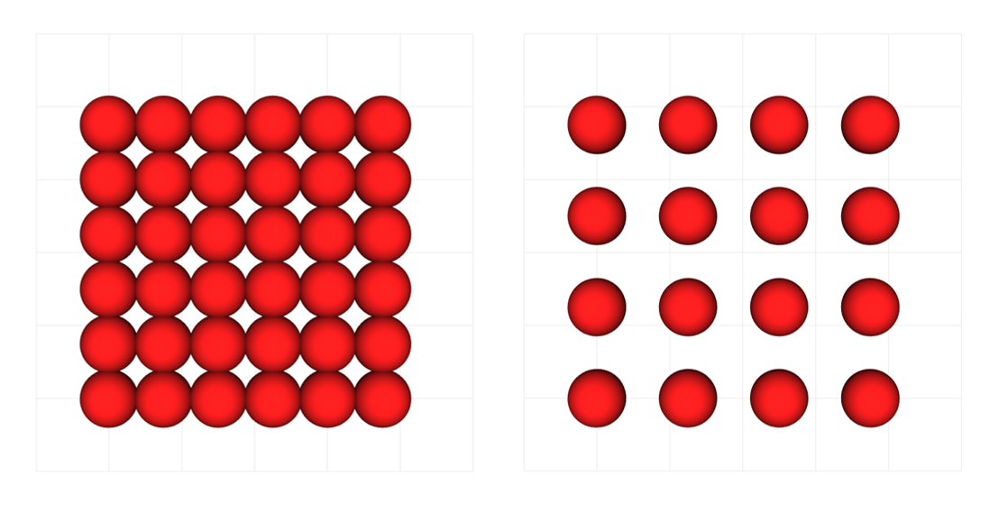

# Creating a model

## Basic model structure
Models can easily be created following the code structure presented below:

```python
"""Script to test the spring components of neurites."""
from neurorosettes.simulation import Simulation, Container


def create_tissue(container: Container) -> None:
    """Creates and registers new neurons in the simulation world."""
    pass

def main() -> None:
     # Initialize simulation objects
    sim_world = Simulation.from_file("config.yml")
    # Create initial configuration
    create_tissue(sim_world.container)
    # Run the simulation to check if springs work
    sim_world.run()
    # Plot the results (mark interactive as False to automatically  close the window)
    sim_world.container.animator.show(interactive=True)

if __name__ == "__main__":
    main()
```

### Loading data from the configuration file
All the data required to create a new simulation is stored in YAML configuration files.

## Tissue initialization stamdard functions



### Running the simulation