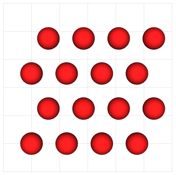

# Standard tissue initialization

## Rectangular grid

The `RectangularGrid` class enables users to create regular grids of cell bodies based
on the dimension of the tissue and the spacing between cells. As an example, the figure
obtained was captured for a tissue with the same size but different spacing values.

## Hexagonal grid

The `HexagonalGrid` class also creates structured grids, but cells are shifted to the side
on each row, so that the projection of a cell on the following row is placed between
two cells. The `size` and `spacing` of the grid can be defined by the user.

